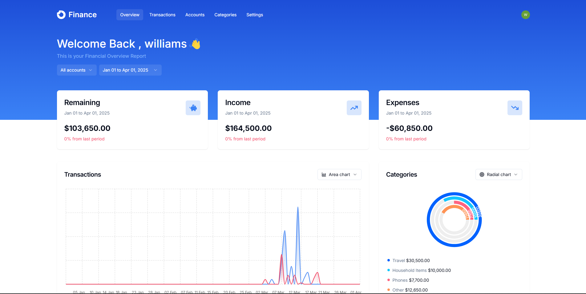

# Finance App

A modern personal finance application built with Next.js, Hono, Drizzle ORM, and Neon.



## Overview

This finance app allows users to track their accounts, categories, and transactions with a clean and intuitive dashboard. It features data visualization, CSV imports, and secure authentication.

## Features

- **Dashboard**: Overview of financial health with interactive charts (Area, Bar, Line, Pie, Radar, Radial).
- **Accounts & Categories**: Create and manage multiple accounts and expense categories.
- **Transactions**: Detailed list of transactions with filtering by date and account.
- **CSV Import**: Easily bulk-upload transactions from CSV files.
- **Authentication**: Secure user management powered by Clerk.
- **API**: Robust backend built with Hono for efficient data handling.

## Tech Stack

- **Framework**: [Next.js 14](https://nextjs.org/) (App Router)
- **API**: [Hono](https://hono.dev/)
- **Database**: [Neon](https://neon.tech/) (PostgreSQL)
- **ORM**: [Drizzle ORM](https://orm.drizzle.team/)
- **Authentication**: [Clerk](https://clerk.com/)
- **State Management**: [TanStack Query](https://tanstack.com/query/latest) & [Zustand](https://github.com/pmndrs/zustand)
- **Styling**: [Tailwind CSS](https://tailwindcss.com/) & [Shadcn UI](https://ui.shadcn.com/)
- **Charts**: [Recharts](https://recharts.org/)
- **Form Handling**: [React Hook Form](https://react-hook-form.com/) & [Zod](https://zod.dev/)

## Requirements

- [Bun](https://bun.sh/) (Recommended package manager)
- [Node.js](https://nodejs.org/) (v18 or higher)
- [Neon Database Account](https://neon.tech/)
- [Clerk Account](https://clerk.com/)

## Getting Started

### 1. Clone the repository

```bash
git clone <repository-url>
cd finance-app
```

### 2. Install dependencies

```bash
bun install
```

### 3. Setup Environment Variables

Create a `.env.local` file in the root directory and add the following:

```env
# Clerk Authentication
NEXT_PUBLIC_CLERK_PUBLISHABLE_KEY=your_publishable_key
CLERK_PUBLISHABLE_KEY=your_publishable_key
CLERK_SECRET_KEY=your_secret_key
NEXT_PUBLIC_CLERK_SIGN_IN_URL=/sign-in
NEXT_PUBLIC_CLERK_SIGN_UP_URL=/sign-up

# Database
DATABASE_URL=your_neon_database_url

# API
NEXT_PUBLIC_API_URL=http://localhost:3000
```

### 4. Database Setup

Generate and run migrations:

```bash
bun run db:generate
bun run db:migrate
```

### 5. Run the development server

```bash
bun run dev
```

Open [http://localhost:3000](http://localhost:3000) with your browser to see the result.

## Scripts

- `bun run dev`: Starts the development server.
- `bun run build`: Builds the application for production.
- `bun run start`: Starts the production server.
- `bun run lint`: Runs ESLint for code quality checks.
- `bun run db:generate`: Generates Drizzle migrations based on schema changes.
- `bun run db:migrate`: Applies migrations to the database.
- `bun run db:studio`: Opens Drizzle Studio to explore your database.

## Project Structure

- `app/`: Next.js App Router (pages and API routes).
- `components/`: Reusable UI components.
- `db/`: Database schema and connection configuration.
- `drizzle/`: Generated SQL migrations.
- `features/`: Modularized feature logic (hooks, components, API calls).
- `hooks/`: Custom React hooks.
- `lib/`: Utility functions and shared libraries.
- `providers/`: Context providers for the application.
- `public/`: Static assets.

